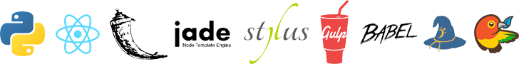

##### Python, Flask, and React web application boilerplate

---



---

## Installation

This will walk you through install and configuring all the required dependencies.

###### Python

First things first, you'll need to [install Python](https://www.python.org/downloads/) if you haven't already.  

###### pip

Python 2.7.9 or higher comes shipped with **pip**, its package manager, pre-installed.  If you are running earlier than 2.7.9, head over and [install **pip**](https://pip.pypa.io/en/latest/installing.html).

Time to let **pip** work its magic, like so (in the root directory):

` $ pip install -r requirements.txt `

###### virtualenv

Let's create the virtual environment that Python will use to execute and manage its dependencies for *speakeasy*. Make sure you are in the directory you have cloned *speakeasy* into and then:

```
$ cd dev
$ virtualenv application
$ . application/bin/active
```

This will get you into your virtual environment so that you can install...

###### Flask

Inside your virtual environment you just activated, you will want to run the following command:

` $ pip install Flask `

At this point you'll see Flask being downloaded and installed.  Once it is complete, you'll want to leave the virtual environment by using this command:

` $ deactivate `

###### npm modules

This one should be pretty self-evident at this point, but if not:

` $ npm install `

This will get all the node module dependencies for the application.

###### Bower components

Same as above, just run the install command and Bower should do the rest.

` $ bower install `

## Build System

*speakeasy* uses [GulpJS](http://www.gulpjs.com) to create builds and manage its files. Let's check out how to make a build.

At this point in time, the application structure is filled with example items to help highlight where things are placed and how they are used.  Just open up the *speakeasy* root directory in your terminal and type:

` $ gulp `

All of the build tasks will run, and when it is finished, you will be notified. Once complete, everything will now be compiled, configured, and rendered in the `build` folder, which was just created.

Also included is a `watch` command which allows you to automatically update your build whenever you change a template, style, Javascript file, or even a Python application file, such as the routing.

Access it by using ` $ gulp watch ` in your terminal.

## Running your application

In the *speakeasy* root directory, the following terminal command will run the application:

` $ sh run.sh `

You will now be able to access your application at **http://localhost:5000/** in your browser. 


